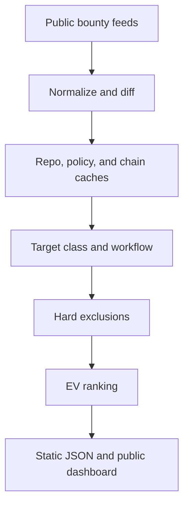

# ScoutIQ v2

ScoutIQ ranks public bug bounty targets by estimated payable value, not by how interesting a repository looks.

```text
EV = min(max reward, $50k) × P(findable by us) × P(payable) × P(first)
```

The collector runs on GitHub Actions, writes static JSON, and serves a public dashboard. It uses no LLM and no paid backend. The official program policy always controls authorization.

ScoutIQ is public open-source software under the MIT License. All pipeline logic, scoring rules, trap evidence, tests, workflows, and generated public datasets are auditable in this repository. Credentials are never committed.

## What changed in v2

- Routes each target to `live-web`, `live-api`, `live-contract`, `ai-agent`, `static-source`, or `static-source-hardened`.
- Enriches GitHub and GitLab targets with repository age, activity, new files, merged PR size, contributors, releases, languages, tree signals, security tooling, and advisories.
- Scrapes official policy pages incrementally to infer the lowest severity that can clear the configured payable reward.
- Detects developer-known issues, disabled security fixes, low-only parser DoS, and dormant deployed contracts.
- Permanently remembers completed audits in `data/audited.json`, unless fresh code rises by more than 40 points from the audit baseline.
- Hard-excludes traps before ranking. Excluded records retain `excludeReason` in JSON for auditability but never appear in the normal dashboard or CLI shortlist.
- Defaults to the top 25 positive-EV candidates and provides dedicated live and fresh-source lanes.

## Pipeline



Six discovery feeds currently cover HackerOne, Bugcrowd, Intigriti, YesWeHack, Federacy, and community-listed public programs. Feed data is discovery evidence, not permission.

## Scoring

### HardeningIndex

High means avoid:

```text
min(30, stars / 300)
+20 security tooling
+15 repo older than 4 years
+15 more than 100 contributors
+10 at least 3 resolved advisories
+10 mature-core keyword
```

### FreshCodeIndex

High means investigate:

```text
min(35, commits_90d / 2)
+min(25, files_added_90d × 3)
+20 merged PR over 800 additions
+20 target or repository added to the program within 45 days
```

### KnownIssueRisk

```text
+40 developer-known pattern
+30 open or recent advisory matching the path
+30 security fix gated behind a disabled flag or dormant fork
```

### Probabilities

```text
P_findable = clamp(
  0.15
  + 0.45 × FreshCodeIndex / 100
  + 0.30 × (100 - HardeningIndex) / 100  [measured repositories only]
  + 0.10 × proficiency_fit
)

P_payable = (ceiling >= program floor)
  × (1 - KnownIssueRisk / 100)
  × eligibility

P_first = clamp(
  0.2
  + 0.5 × (program age < 90 days)
  + 0.3 × crowd term
)
```

Mature crypto and hardened static-source classes receive explicit findability multipliers after the base formula. This encodes the observed failure rate of blind core-library review.

## Hard exclusions

A target is removed before ranking when any of these is true:

- Its plausible severity ceiling is below the program's payable floor.
- `HardeningIndex > 70` and `FreshCodeIndex < 25`.
- `KnownIssueRisk >= 60`.
- It is in `data/audited.json` and fresh code has not jumped by more than 40 points.
- It is closed, unpaid, target-ineligible, invite-only, KYC-required, explicitly unavailable to Indian researchers, or explicitly lacks required safe harbor.
- It is a deployed contract with an explicit `tx30d == 0` or `tvl == 0` signal.

Unknown is not silently converted to evidence. An unresolved repository has `hardeningIndex: null`, its hardening term is omitted from `P(findable)`, and its repository metrics remain `null`, never zero. Unparsed policy floors use the configurable conservative default and are labeled `conservative-default`. Chain dormancy only fires on configured explorer/RPC evidence.

## Run locally

Requirements: Node.js 22 or newer.

```bash
npm ci
npm test
```

Run a complete collection of every stale or unresolved repository:

```bash
npm run collect
```

Force the weekly repository refresh:

```bash
npm run collect:weekly
```

Query the default top 25:

```bash
npm run shortlist
```

Query only live services and contracts:

```bash
npm run shortlist -- --lane live
```

Query only source targets with `FreshCodeIndex > 50`:

```bash
npm run shortlist -- --lane fresh-source
```

Machine-readable output:

```bash
npm run shortlist -- --lane live --format json
```

## Configuration

`config/preferences.json` sets the desired minimum reward and initial reviewed list.

`config/program-overrides.json` stores verified policy facts that cannot be parsed reliably:

```json
{
  "defaults": {
    "researcherCountry": "IN",
    "minimumPayableReward": 1000,
    "unknownProgramFloor": "MEDIUM",
    "unknownResolvedReports": 25
  },
  "programs": {
    "program:example": {
      "programFloorSeverity": "HIGH",
      "excludedCountries": ["IN"],
      "safeHarborRequired": true,
      "noSafeHarbor": true
    }
  }
}
```

`config/live-targets.json` enables evidence-based EVM checks. Do not commit API keys; refer to Actions secret names:

```json
{
  "version": 1,
  "targets": [
    {
      "match": "Example Vault",
      "adapter": "evm",
      "chainId": 1,
      "address": "0x0000000000000000000000000000000000000000",
      "rpcUrlEnv": "EXAMPLE_RPC_URL",
      "explorerApiUrl": "https://api.etherscan.io/v2/api",
      "explorerApiKeyEnv": "ETHERSCAN_API_KEY"
    }
  ]
}
```

`data/audited.json` is persistent memory. Add the program or repository alias, verdict, date, note, and its FreshCodeIndex at audit time.

## GitHub Actions

`.github/workflows/radar.yml` runs at minute 17 each hour to discover changes and at 02:41 UTC each Sunday to force-refresh every repository. GitHub metadata is fetched in GraphQL batches of 100 repositories; tree, history, advisory, and source-scan evidence is cached for seven days. There is no repository sample budget.

Add an Actions secret named `SCOUTIQ_GITHUB_TOKEN` containing a read-only fine-grained PAT for public repositories. Every GitHub REST and GraphQL request uses it. The workflow falls back to the authenticated per-run `github.token` so a missing PAT never causes anonymous 60-request/hour calls. Add `GITLAB_TOKEN` only if public GitLab rate limits become a problem. Never commit either token.

Repository failures are emitted as `[repo-enrichment]` log lines and stored as explicit pending records with `lastError`; failed lookups do not write zero-valued evidence. DEV_KNOWN detection scans prioritized test and source blobs for suspicious test filenames, known-vulnerability comments, and disabled security/fork gates. DOS_CEILING and DORMANT are computed as hard exclusion traps during EV evaluation.

Scheduled runs do not install frontend dependencies. Source-change and manual runs execute the complete build and test suite. This keeps private-repository Actions usage low while still validating code changes.

## Output schema

`public/data/programs.json` retains the v1 fields and adds:

```text
hardeningIndex, freshCodeIndex, knownIssueRisk,
payableSeverityCeiling, programFloorSeverity, workflow,
pFindable, pPayable, pFirst, effectiveReward, rewardCap, evScore, traps,
repoSignals, liveState, excludeReason, honestReason
```

The same decision fields are attached to each public target. Full enrichment evidence remains in `data/repo_cache.json`; public JSON carries only the lean evidence needed to explain a rank.

## Files

```text
scripts/collect.mjs             orchestration and fail-soft snapshots
scripts/radar-core.mjs          feed normalization, dedupe, and change history
scripts/repo-enrichment.mjs     GitHub GraphQL/REST and GitLab enrichment
scripts/policy-enrichment.mjs   policy scraper and severity floor parser
scripts/live-enrichment.mjs     configured explorer/RPC live-state checks
scripts/ev-core.mjs             class map, indices, traps, hard filters, EV
scripts/query.mjs               default, live, and fresh-source CLI lanes
data/audited.json               persistent completed-audit memory
```

## Responsible use

Only test public programs you are personally eligible for, within the exact current policy. Use your own accounts and data. Do not test third parties, exceed permitted traffic, or treat a discovery feed as authorization.
