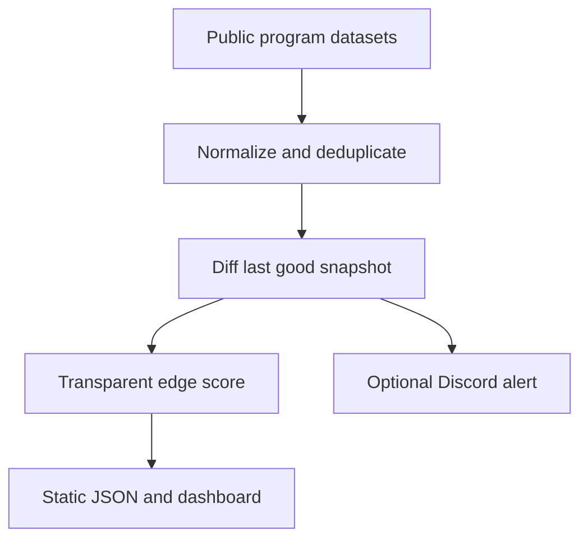

# ScopePulse

ScopePulse is an independent, zero-backend radar for public bug bounty programs. A scheduled GitHub Action collects public datasets, normalizes scopes, detects meaningful changes, assigns a transparent edge score, and publishes a searchable GitHub Pages dashboard.

It is optimized for finding newly added, inspectable targets before spending model tokens on deep triage. It is not affiliated with BBRadar or any bounty platform, and it does not scrape or reproduce proprietary BBRadar data.

## What makes it useful

- Tracks new programs, new targets, scope edits, reward increases, and reactivations.
- Prioritizes source code, repositories, APIs, smart contracts, testnets, and local-testing language.
- Explains every score instead of hiding ranking behind an AI model.
- Produces a compact 90-minute triage brief for any result.
- Keeps watchlist and reviewed state locally in your browser.
- Preserves the last good snapshot when an upstream source fails.
- Waits for two successful misses before removing a program from the dataset.
- Sends optional Discord alerts without requiring a server.
- Uses no paid API and no LLM during collection.

## Data flow



The dashboard always links back to the official program policy. Discovery data is not authorization. Verify current scope, safe harbor, account rules, rate limits, and testing environments on the official policy before testing anything.

## Sources included in v0.1

| Feed | Coverage |
| --- | --- |
| `arkadiyt/bounty-targets-data` | HackerOne, Bugcrowd, Intigriti, YesWeHack, Federacy |
| `projectdiscovery/public-bugbounty-programs` | Community-curated public and independent programs |
| `config/manual-programs.json` | Programs you add from official public policies |

The upstream feeds are discovery indexes, not legal authority. ScopePulse deliberately avoids guessing at private program data, undisclosed reports, or actual researcher competition.

## One-time GitHub setup

1. Create an empty **public** GitHub repository. Public repositories can use standard GitHub-hosted Actions runners without consuming private-repository minutes.
2. Copy this project into the repository and push it to a branch named `main`.
3. In **Settings → Pages**, choose **GitHub Actions** as the source.
4. Open **Actions → Refresh ScopePulse → Run workflow** for the first collection.
5. After the run finishes, the Pages URL appears in the deployment step and the repository's **Deployments** panel.

Example push commands:

```bash
git init
git add .
git commit -m "build: launch ScopePulse"
git branch -M master
git remote add origin https://github.com/Vector3on/ScoutIq.git
git push -u origin main
```

The workflow runs at minute 17 of every hour. Using a non-zero minute avoids the heaviest scheduled-workflow congestion. It only rebuilds and deploys when the normalized dataset or source health actually changes.

## Your preferences

Edit `config/preferences.json`:

```json
{
  "reviewedPrograms": ["Decred", "Leather", "MetaMask"],
  "minReward": 1000
}
```

`reviewedPrograms` starts hidden in the dashboard. You can also mark individual results reviewed in the UI. Browser changes stay in local storage and are not committed.

## Add a program the feeds miss

Add an official public policy to `config/manual-programs.json` using the same compact shape accepted by the generic adapter:

```json
[
  {
    "name": "Example Security Program",
    "url": "https://security.example.com/bug-bounty",
    "status": "open",
    "public": true,
    "paid": true,
    "min_bounty": { "value": 1000, "currency": "USD" },
    "max_bounty": { "value": 25000, "currency": "USD" },
    "safe_harbor": "program-defined",
    "targets": {
      "in_scope": [
        {
          "type": "source_code",
          "target": "https://github.com/example/project",
          "description": "Build and test locally using researcher-owned data"
        }
      ]
    }
  }
]
```

Only add information that is already public. Do not commit invitations, credentials, private scopes, or vulnerability details.

## Edge score

The maximum score is 100:

| Signal | Points | What it measures |
| --- | ---: | --- |
| Freshness | 32 | New targets, launches, reward changes, and scope edits, decaying over time |
| Reward | 22 | Confirmed reward ceiling and minimum |
| Inspectability | 24 | Source code, repositories, languages, APIs, smart contracts, and local/testnet language |
| Authorization clarity | 14 | Open status, paid status, safe-harbor field, and disclosure field |
| Low friction | 8 | Smaller typed scope and parsed reward data |

“Lower attention pressure” is only a conservative heuristic for a very fresh, inspectable, small scope. ScopePulse never claims to know how many researchers are active.

## Optional Discord alerts

Create a Discord webhook, then add its URL as the repository Actions secret `DISCORD_WEBHOOK_URL`. New changes are sent after each non-baseline refresh. If the secret is absent, the step exits cleanly.

## Local development

Requirements: Node.js 22 or newer.

```bash
npm ci
npm run test:radar
npm run build
```

Run a live collection only when your network can reach the configured public GitHub raw URLs:

```bash
npm run collect
```

The collector writes:

- `data/state.json`: last good normalized snapshots and change history.
- `public/data/programs.json`: browser-safe current dataset.
- `public/data/events.json`: the latest 200 change events.
- `.radar-run.json`: ignored, per-run notification data.

## Failure behavior

- Each source gets a timeout, payload-size cap, minimum-record sanity check, and three attempts.
- A failed source keeps its previous snapshot and appears unhealthy in the dashboard metadata.
- A missing program becomes stale for one successful poll and is removed only after the second miss.
- The first live run is a baseline import, so it does not announce every existing program as new.
- Scheduled runs do not commit or deploy when nothing material changed.

## Current limits

- Coverage is six public feeds, not every bounty platform on the internet.
- Reward and safe-harbor fields are only as complete as upstream structured data.
- Name-based cross-feed deduplication is intentionally simple and can require a manual alias in a future version.
- GitHub schedules can be delayed, and public-repository schedules are disabled after prolonged repository inactivity.
- The official policy always wins if a feed is stale or incomplete.

## Project structure

```text
app/                       dashboard and scoring explanation
config/                    feeds, preferences, manual programs
scripts/collect.mjs        fetch, fail-soft snapshot, and output
scripts/radar-core.mjs     adapters, deduplication, diff, scoring
scripts/notify.mjs         optional Discord notification
.github/workflows/radar.yml hourly collection and Pages deployment
tests/radar-core.test.mjs  normalization, diff, grace, scoring tests
```

## Responsible use

Use ScopePulse only to discover public, authorized security programs. Do not scan or test a target merely because it appears in this dashboard. Open the linked official policy, confirm the exact asset and permitted method, and keep all testing within those rules.
